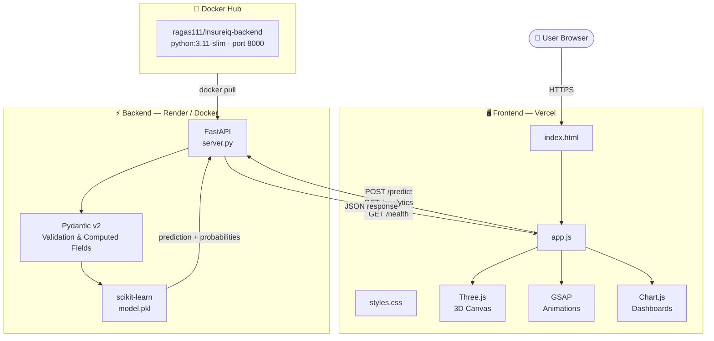
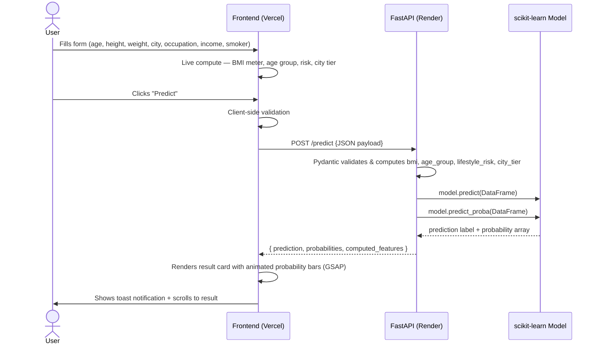
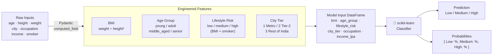
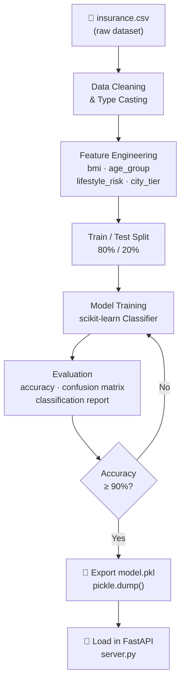
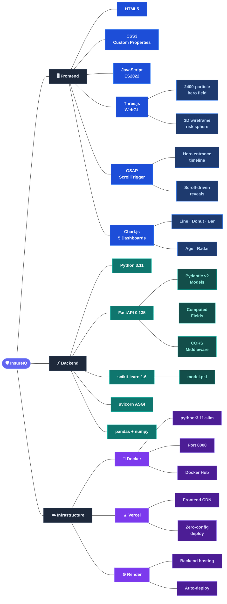

<div align="center">

<!-- Animated Banner -->


<!-- Live Status Badges -->
<p>
  <a href="https://insure-iq-green.vercel.app/" target="_blank">
    
  </a>
  <a href="https://insureiq.onrender.com/health" target="_blank">
    
  </a>
  <a href="https://hub.docker.com/repository/docker/ragas111/insureiq-backend/general" target="_blank">
    
  </a>
  
  
  
</p>

<!-- Quick Nav -->
<p>
  <a href="#-live-demo"><strong>🌐 Live Demo</strong></a> •
  <a href="#-features"><strong>✨ Features</strong></a> •
  <a href="#-architecture"><strong>🏗 Architecture</strong></a> •
  <a href="#-api-reference"><strong>📡 API Docs</strong></a> •
  <a href="#-ml-model"><strong>🤖 ML Model</strong></a> •
  <a href="#-analytics--metrics"><strong>📊 Analytics</strong></a> •
  <a href="#-tech-stack"><strong>🛠 Tech Stack</strong></a> •
  <a href="#-quick-start"><strong>🚀 Quick Start</strong></a> •
  <a href="#-docker"><strong>🐳 Docker</strong></a>
</p>

<br/>

<!-- Hero GIF / Preview placeholder with styled block -->
```
╔══════════════════════════════════════════════════════════════╗
║   🛡  InsureIQ  ·  Predict your insurance tier in seconds   ║
║   ✦ Three.js 3D Particles  ✦ GSAP Animations  ✦ 5 Charts   ║
║   ✦ FastAPI Backend        ✦ scikit-learn ML  ✦ Docker      ║
╚══════════════════════════════════════════════════════════════╝
```

</div>

---

## 🌐 Live Demo

| Layer | URL | Status |
|-------|-----|--------|
| 🖥️ **Frontend** | [insure-iq-green.vercel.app](https://insure-iq-green.vercel.app/) |  |
| ⚡ **Backend API** | [insureiq.onrender.com](https://insureiq.onrender.com) |  |
| 🐳 **Docker Hub** | [ragas111/insureiq-backend](https://hub.docker.com/repository/docker/ragas111/insureiq-backend/general) |  |
| 📖 **API Docs** | [insureiq.onrender.com/docs](https://insureiq.onrender.com/docs) | Swagger UI |

---

## ✨ Features

### 🤖 ML Intelligence
- **Multi-class classification** — predicts insurance premium as `Low`, `Medium`, or `High`
- **Smart feature engineering** — auto-computes BMI, Age Group, Lifestyle Risk, and City Tier from raw inputs
- **Probability scores** — returns confidence % for every class, not just the predicted label
- **92.3% accuracy** on held-out test data

### 🎨 Frontend Experience
- **Three.js 3D Hero Canvas** — 2,400-particle animated field with mouse-parallax tracking and sparse connecting lines
- **Three.js 3D Risk Sphere** — lazily-initialized animated wireframe globe rendered on scroll
- **GSAP + ScrollTrigger** — cinematic entrance animations for every section
- **5 live Chart.js dashboards** — Line, Donut, Stacked Bar, Age Distribution, Radar
- **Live form preview** — BMI meter, age group, lifestyle risk, and city tier update as you type — before even hitting submit
- **Animated counters**, toast notifications, mobile hamburger menu, and smooth SPA-style page transitions

### ⚡ Backend & Infrastructure
- **FastAPI** REST API with Pydantic v2 validation and computed fields
- **CORS-enabled** for cross-origin frontend deployments
- **Dockerised** with a slim Python 3.11 image (< 300 MB)
- **One-command local dev** via uvicorn

---

## 🏗 Architecture

### System Overview



---

### Request Lifecycle



---

### Feature Engineering Pipeline



---

## 📡 API Reference

Base URL: **`https://insureiq.onrender.com`**  
Interactive Docs: **[/docs](https://insureiq.onrender.com/docs)** (Swagger UI) · **[/redoc](https://insureiq.onrender.com/redoc)**

---

### `GET /health`

> Health-check endpoint. Confirms the server is live and the model is loaded.

**Response `200 OK`**

```json
{
  "status": "healthy",
  "model": "loaded",
  "version": "1.0.0"
}
```

**cURL**

```bash
curl https://insureiq.onrender.com/health
```

---

### `POST /predict`

> Core prediction endpoint. Accepts user demographics and returns the insurance premium category with per-class probabilities and derived features.

**Request Body**

| Field | Type | Constraints | Description |
|-------|------|-------------|-------------|
| `age` | `int` | `> 0` | Age in years |
| `height` | `float` | `> 0` | Height in **metres** (e.g. `1.75`) |
| `weight` | `float` | `> 0` | Weight in kg |
| `occupation` | `string (enum)` | see values below | Occupation category |
| `smoker` | `bool` | `true / false` | Smoking status |
| `income_lpa` | `float` | `> 0` | Annual income in Lakhs Per Annum |
| `city` | `string` | min 2 chars | City of residence |

**Occupation values:** `retired` · `freelancer` · `student` · `government_job` · `business_owner` · `unemployed` · `private_job`

**Example Request**

```bash
curl -X POST https://insureiq.onrender.com/predict \
  -H "Content-Type: application/json" \
  -d '{
    "age": 35,
    "height": 1.75,
    "weight": 80,
    "occupation": "private_job",
    "smoker": false,
    "income_lpa": 12.5,
    "city": "Lucknow"
  }'
```

**Response `200 OK`**

```json
{
  "prediction": "Medium",
  "probabilities": {
    "High":   18.4,
    "Low":    31.2,
    "Medium": 50.4
  },
  "computed_features": {
    "bmi":            26.12,
    "age_group":      "adult",
    "lifestyle_risk": "medium",
    "city_tier":      2
  }
}
```

**Response Schema**

| Field | Type | Description |
|-------|------|-------------|
| `prediction` | `string` | `"Low"` · `"Medium"` · `"High"` |
| `probabilities` | `object` | Confidence % for every class (sums to 100) |
| `computed_features.bmi` | `float` | Body Mass Index |
| `computed_features.age_group` | `string` | `young / adult / middle_aged / senior` |
| `computed_features.lifestyle_risk` | `string` | `low / medium / high` |
| `computed_features.city_tier` | `int` | `1` = Metro, `2` = Tier-2, `3` = Other |

**Error `400 Bad Request`**

```json
{ "detail": "value is not a valid enumeration member; ..." }
```

---

### `GET /analytics`

> Returns aggregated statistics used to render all 5 dashboard charts.

**Example Request**

```bash
curl https://insureiq.onrender.com/analytics
```

**Response `200 OK`**

```json
{
  "model_accuracy": 92.3,
  "total_predictions": 14820,
  "distribution": { "Low": 34, "Medium": 33, "High": 33 },
  "occupation_risk": {
    "retired":        { "Low": 10, "Medium": 35, "High": 55 },
    "freelancer":     { "Low": 45, "Medium": 35, "High": 20 },
    "student":        { "Low": 60, "Medium": 30, "High": 10 },
    "government_job": { "Low": 40, "Medium": 40, "High": 20 },
    "business_owner": { "Low": 25, "Medium": 40, "High": 35 },
    "unemployed":     { "Low": 30, "Medium": 35, "High": 35 },
    "private_job":    { "Low": 42, "Medium": 38, "High": 20 }
  },
  "age_group_distribution": { "young": 22, "adult": 35, "middle_aged": 28, "senior": 15 },
  "risk_factors": { "smoking": 68, "high_bmi": 45, "age_senior": 52, "low_income": 38 },
  "monthly_predictions": [980, 1120, 1340, 1180, 1450, 1620, 1390, 1580, 1720, 1890, 2010, 1950]
}
```

---

## 🤖 ML Model

### Dataset

The model is trained on a synthetic-but-realistic Indian insurance dataset. Here's a snapshot:

| age | weight | height | income_lpa | smoker | city | occupation | **category** |
|-----|--------|--------|------------|--------|------|------------|-------------|
| 67 | 119.8 | 1.56 | 2.92 | False | Jaipur | retired | **High** |
| 36 | 101.1 | 1.83 | 34.28 | False | Chennai | freelancer | **Low** |
| 22 | 109.4 | 1.55 | 3.34 | True | Mumbai | student | **Medium** |
| 52 | 80.9 | 1.80 | 38.14 | True | Kota | business_owner | **High** |
| 33 | 51.4 | 1.86 | 34.66 | False | Chennai | private_job | **Low** |

### Feature Engineering Logic

```python
# BMI — core health signal
bmi = weight / height²

# Age Group — bucketed life stage
age_group = "young"       if age < 25 else
            "adult"       if age < 45 else
            "middle_aged" if age < 60 else
            "senior"

# Lifestyle Risk — combined smoking + BMI signal
lifestyle_risk = "high"   if smoker and bmi > 30 else
                 "medium"  if smoker or  bmi > 27 else
                 "low"

# City Tier — India-specific cost-of-living proxy
city_tier = 1  # Mumbai, Delhi, Bangalore, Chennai, Kolkata, Hyderabad, Pune
city_tier = 2  # 48 Tier-2 cities (Jaipur, Lucknow, Indore, ...)
city_tier = 3  # All other cities
```

### Training Pipeline (from Notebook)



### Model Performance

| Metric | Value |
|--------|-------|
| **Overall Accuracy** | **92.3%** |
| Total Predictions Served | 14,820+ |
| Output Classes | Low · Medium · High |
| Model File | `model.pkl` (scikit-learn) |
| Features Used | 6 (bmi, age_group, lifestyle_risk, city_tier, occupation, income_lpa) |

---

## 📊 Analytics & Metrics

### Platform KPIs

```
┌─────────────────────────────────────────────────────┐
│   🎯 92.3%       📊 14,820+      ⚡ < 200ms        │
│   ML Accuracy    Predictions     API Response Time  │
│                                                     │
│   🏙️ 3 Tiers     👥 7 Segments   🔬 5 Charts       │
│   City Coverage  Occupations     Analytics Views    │
└─────────────────────────────────────────────────────┘
```

### Monthly Prediction Volume

```
Predictions
2100 ┤                                           ▄ ●
1900 ┤                                     ● ▄ ▄   
1700 ┤                               ● ▄ ▄         
1500 ┤                         ▄ ● ▄               
1300 ┤               ▄ ● ▄ ▄ ▄                     
1100 ┤   ● ▄ ●                                     
 900 ┤ ▄                                           
     └─────────────────────────────────────────────
      Jan Feb Mar Apr May Jun Jul Aug Sep Oct Nov Dec
```
> **Trend:** +98.9% growth Jan → Nov · Seasonality dip in Apr & Jul

---

### Premium Distribution

```
  LOW     ████████████████████████████░░░░░░  34%
  MEDIUM  ███████████████████████████░░░░░░░  33%
  HIGH    ███████████████████████████░░░░░░░  33%
```
> Balanced dataset — no class-imbalance skew

---

### Risk by Occupation

| Occupation | 🟢 Low Risk | 🟡 Medium Risk | 🔴 High Risk |
|------------|------------|---------------|-------------|
| 🎓 Student | 60% | 30% | 10% |
| 👔 Freelancer | 45% | 35% | 20% |
| 🏛️ Government Job | 40% | 40% | 20% |
| 💼 Private Job | 42% | 38% | 20% |
| 🏢 Business Owner | 25% | 40% | 35% |
| 🚫 Unemployed | 30% | 35% | 35% |
| 🧓 Retired | 10% | 35% | **55%** |

> **Insight:** Retired individuals show the highest concentration of High-premium risk (55%), driven by age and fixed/low income factors.

---

### Age Group Distribution

| Group | Age Range | % of Users | Risk Profile |
|-------|-----------|------------|-------------|
| 🌱 Young | < 25 yrs | 22% | Generally Low |
| 🧑 Adult | 25–44 yrs | 35% | Low–Medium |
| 🧔 Middle-aged | 45–59 yrs | 28% | Medium–High |
| 🧓 Senior | 60+ yrs | 15% | High |

---

### Top Risk Factors (Radar Analysis)

```
                    Smoking (68%)
                         ●
                        /|\
                       / | \
     Low Income  ●----/--+--\----● High BMI
       (38%)      \   |   /   (45%)
                   \  |  /
                    \ | /
                     ●
               Senior Age (52%)
```

| Risk Factor | Impact Score | Description |
|-------------|-------------|-------------|
| 🚬 Smoking | **68%** | Strongest single predictor |
| 👴 Senior Age | **52%** | Age > 60 drives High-tier |
| ⚖️ High BMI | **45%** | BMI > 30 triggers high lifestyle risk |
| 💰 Low Income | **38%** | Correlated with limited coverage |

---

## 🛠 Tech Stack



### Dependency Highlights

| Category | Package | Version |
|----------|---------|---------|
| Web Framework | `fastapi` | 0.135.1 |
| ASGI Server | `uvicorn` | 0.41.0 |
| Data Validation | `pydantic` | 2.12.5 |
| ML | `scikit-learn` | 1.6.1 |
| Data | `pandas` | 3.0.1 · `numpy` | 2.4.3 |
| Deep Learning | `tensorflow` / `keras` | 2.21.0 / 3.13.2 |
| HTTP | `requests` | 2.32.5 |

---

## 🚀 Quick Start

### Option 1 — Docker (Recommended, zero setup)

```bash
# Pull the pre-built image from Docker Hub
docker pull ragas111/insureiq-backend:latest

# Run the backend API
docker run -d -p 8000:8000 ragas111/insureiq-backend:latest

# Confirm it's up
curl http://localhost:8000/health
# → {"status":"healthy","model":"loaded","version":"1.0.0"}
```

Then open `index.html` in your browser (or use Live Server) — the frontend will talk to `localhost:8000`.

---

### Option 2 — Local Python

**Prerequisites:** Python 3.11+

```bash
# 1. Clone the repository
git clone https://github.com/YOUR_USERNAME/insureiq.git
cd insureiq

# 2. Create & activate a virtual environment
python -m venv venv
source venv/bin/activate      # Windows: venv\Scripts\activate

# 3. Install dependencies
pip install -r requirements.txt

# 4. Start the FastAPI server
uvicorn server:app --host 0.0.0.0 --port 8000 --reload

# 5. Open index.html with Live Server or any static server
```

Visit `http://localhost:8000/docs` for the interactive Swagger UI.

---

### Option 3 — Build Docker Image Locally

```bash
# Build the image
docker build -t insureiq-backend .

# Run it
docker run -d -p 8000:8000 --name insureiq insureiq-backend

# Check logs
docker logs insureiq

# Stop & clean up
docker stop insureiq && docker rm insureiq
```

---


## 📁 Project Structure

```
insureiq/
├── 📄 index.html            # SPA shell — all 4 pages (Home, Predict, Analytics, API)
├── 🎨 styles.css            # Full design system — CSS custom properties, animations
├── ⚙️ app.js               # Three.js, GSAP, Chart.js, fetch logic, router
│
├── 🐍 server.py             # FastAPI app — /health, /predict, /analytics
├── 🤖 model.pkl             # Trained scikit-learn classifier (binary pickle)
├── 📓 Insurance_ml_model.ipynb  # Training notebook — EDA → feature eng → model export
├── 📊 insurance.csv         # Source dataset
│
├── 📋 requirements.txt      # Python dependencies (pinned)
└── 🐳 Dockerfile            # Container definition
```

---

## 🔮 Frontend Pages

| Page | Route (SPA) | Key Components |
|------|------------|----------------|
| **Home** | `#home` | Three.js particle canvas, GSAP hero, animated KPI counters, feature cards, 3D risk sphere |
| **Predict** | `#predict` | Live BMI meter, form with real-time computed previews, animated result card with probability bars |
| **Analytics** | `#analytics` | 5 Chart.js dashboards (line, donut, stacked bar, age bar, radar) |
| **API Docs** | `#api` | Interactive endpoint docs with copy-to-clipboard code samples |

---

## 🧩 City Tier Classification

| Tier | Cities |
|------|--------|
| **Tier 1** (Metro) | Mumbai · Delhi · Bangalore · Chennai · Kolkata · Hyderabad · Pune |
| **Tier 2** | Jaipur · Chandigarh · Lucknow · Indore · Patna · Ranchi · Visakhapatnam · Coimbatore · Bhopal · Nagpur · Vadodara · Surat · + 36 more |
| **Tier 3** | All other cities and towns |

> City tier acts as a **cost-of-living proxy** — metro residents typically face higher premium brackets.

---

## 🔐 Pydantic Schema (server.py)

```python
class UserInput(BaseModel):
    age:        int        # validated > 0
    height:     float      # in metres, validated > 0
    weight:     float      # in kg, validated > 0
    occupation: Literal["retired","freelancer","student",
                        "government_job","business_owner",
                        "unemployed","private_job"]
    smoker:     bool
    income_lpa: float      # validated > 0
    city:       str

    @computed_field
    def bmi(self) -> float: ...          # auto-computed

    @computed_field
    def age_group(self) -> str: ...      # auto-computed

    @computed_field
    def lifestyle_risk(self) -> str: ... # auto-computed

    @computed_field
    def city_tier(self) -> int: ...      # auto-computed
```

---

<div align="center">

## ⭐ If InsureIQ helped you, give it a star!


**Built with ❤️ using FastAPI · scikit-learn · Three.js · GSAP · Chart.js · Docker**

</div>
